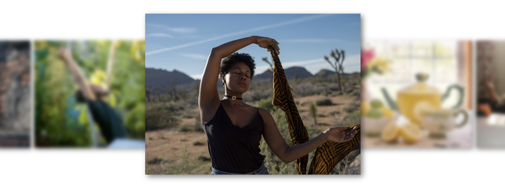

# Focus Carousel



シンプルで軽量、フォーカスエフェクト付きの画像カルーセルライブラリ

```
Create   : 2024-08-20
Author   : Yugeta.Koji
Modified : 2026-02-19
Editor   : AI Assistant (Kiro)
```

## 特徴

- 📦 **軽量** - 外部ライブラリ不要、純粋なJavaScriptとCSS
- ♿ **アクセシブル** - キーボード操作とスクリーンリーダーに対応
- 🔄 **無限ループ** - シームレスな循環スクロール（ON/OFF可能）
- 🎯 **フォーカスエフェクト** - 中央のアイテムを自動的に強調表示
- 📱 **レスポンシブ** - モバイルからデスクトップまで対応
- 🎨 **カスタマイズ可能** - 設定オプションで動作を調整
- 🔢 **複数設置対応** - 1ページ内に複数のカルーセルを配置可能

## デモ

https://yugeta.github.io/focus_carousel/src/

## インストール

ファイルをダウンロードして、プロジェクトに配置してください。

```
project/
├── css/
│   ├── carousel.css
│   └── style.css
└── js/
    ├── carousel.js
    ├── main.js
    └── uuid.js
```

## 基本的な使い方

### 1. HTMLマークアップ

```html
<!DOCTYPE html>
<html lang="ja">
<head>
  <meta charset="UTF-8">
  <meta name="viewport" content="width=device-width,initial-scale=1.0">
  <link rel="stylesheet" href="css/style.css">
  <script type="module" src="js/main.js"></script>
</head>
<body>
  <div class="carousel" role="region" aria-label="画像カルーセル">
    <figure>
      <div class="item" role="group" aria-label="画像 1">
        
      </div>
      <div class="item" role="group" aria-label="画像 2">
        
      </div>
      <!-- 必要なだけアイテムを追加 -->
    </figure>
  </div>
</body>
</html>
```

### 2. JavaScriptで初期化

デフォルト設定で使用する場合：

```javascript
import { Carousel } from "./carousel.js"

new Carousel()
```

オプションを指定する場合：

```javascript
import { Carousel } from "./carousel.js"

new Carousel({
  infiniteLoop: true,      // 無限ループを有効化（デフォルト: true）
  minItemsForLoop: 3,      // ループに必要な最小アイテム数（デフォルト: 3）
  blurAmount: 5,           // ぼかし強度（将来の実装用）
  focusScale: 1.5          // フォーカス時の拡大率（将来の実装用）
})
```

## 設定オプション

| オプション | 型 | デフォルト | 説明 |
|-----------|-----|-----------|------|
| `infiniteLoop` | boolean | `true` | 無限ループの有効/無効 |
| `minItemsForLoop` | number | `3` | ループを有効にする最小アイテム数 |
| `blurAmount` | number | `5` | 非フォーカス時のぼかし強度（px） |
| `focusScale` | number | `1.5` | フォーカス時の拡大率 |

## 操作方法

- **マウス/タッチ** - スワイプまたはドラッグでスクロール
- **キーボード** - 左右の矢印キーで移動
- **スクロールホイール** - 横スクロールで移動

## カスタマイズ

### CSSでのスタイル調整

`src/css/carousel.css`を編集して、以下の項目をカスタマイズできます：

```css
.carousel {
  height: 500px;  /* カルーセルの高さ */
}

.carousel figure {
  gap: 10px;      /* アイテム間の間隔 */
  padding: 100px 0;  /* 上下のパディング */
}

.carousel figure .item {
  width: 400px;   /* アイテムの幅 */
}

.carousel figure .item > * {
  filter: blur(5px);  /* 非フォーカス時のぼかし */
}

.carousel figure .item[data-status="active"] > * {
  transform: scale(1.5);  /* フォーカス時の拡大率 */
  filter: blur(0px);      /* フォーカス時はぼかしなし */
}
```

## ブラウザ対応

- Chrome（最新版）
- Firefox（最新版）
- Safari（最新版）
- Edge（最新版）

古いブラウザでは一部機能（scrollendイベント）のフォールバックが動作します。

## アクセシビリティ

- ARIA属性による適切なセマンティクス
- キーボード操作のフルサポート
- スクリーンリーダー対応
- 画像のalt属性による代替テキスト

## 今後の予定

- [ ] ページネーション機能
- [ ] 前へ/次へナビゲーションボタン
- [ ] 自動再生機能
- [ ] 画像の遅延読み込み
- [ ] 3Dエフェクトオプション
- [ ] タッチジェスチャーの最適化

## トラブルシューティング

### アイテムが少ない場合

アイテム数が`minItemsForLoop`未満の場合、無限ループは自動的に無効になります。

### スクロールがスムーズでない

ブラウザのハードウェアアクセラレーションを有効にしてください。

### キーボード操作が効かない

カルーセル要素にフォーカスがあることを確認してください（Tabキーで移動）。

## ライセンス

MIT License

## 更新履歴

- 2024-08-20 : 初回リリース
- 2024-XX-XX : アクセシビリティ対応、キーボード操作追加、設定オプション実装

## 作者

Yugeta.Koji

## 貢献

バグ報告や機能リクエストは、Issuesでお願いします。
