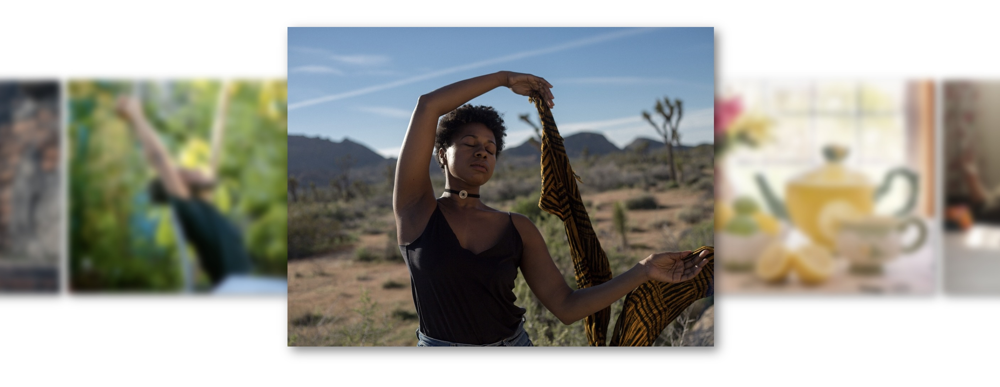

Focus Carousel
===


```
Create : 2024-08-20
Author : Yugeta.Koji
```

# Summary
- カルーセルの少しグレードアップした機能版
- CSSとJavascriptでHTMLに記載した素材を簡単にセットできる仕様
- 他のライブラリなどは使わない簡易コード
- 横スライドを無限にループできる仕様
- １つのページ内に複数のカルーセルを設置可能


# Issue
- スライドITEMの個数制限は？
  - 数が少ない個数の場合のカルーセル
- 無限ループのON/OFF
- ページネーションの追加（予定）
- 横移動ボタンの設置（予定）
- JSを All in One にした方が、サイトへの導入がしやすいかも。


# Howto Build
- HTML
> 以下を記述するだけ。figure直下の.itemを複数追加すると、横スライドする仕様。
```
<div class="carousel">
	<figure>
    <div class="item">
      
    </div>
  </figure>
</div>
```

- 各種設定
  - カルーセル内のitemサイズ
  - 無限ループのON/OFF
  - Focus以外のボカシ強度 : filter:blur(**)
  

# Demo
https://yugeta.github.io/focus_carousel/src/


# Update
- 2024-08-20 : First-commit
